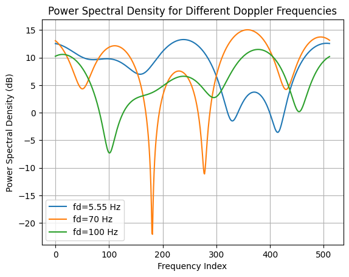

# Multipath Rayleigh Channel with Different Doppler Frequencies

## Introduction
This project simulates the **Power Spectral Density (PSD)** of a multipath Rayleigh fading channel with different Doppler frequencies. The simulation is implemented in **Python** using **NumPy** and **Matplotlib** to analyze how different Doppler frequencies affect signal degradation in a wireless communication environment.

## Features:
- Simulates a **Rayleigh fading channel** with multiple Doppler frequencies.
- Uses **Fast Fourier Transform (FFT)** to compute and visualize **Power Spectral Density (PSD)**.
- Implements **averaging over multiple realizations** to reduce noise and improve accuracy.
- Works with **different Doppler frequencies** to model signal distortions in wireless systems.

## Power Spectral Density Plot:
The following figure shows the **PSD for different Doppler frequencies**:



## Installation & Setup
### **1. Clone the Repository**
Run the following command in your terminal:
```bash
git clone https://github.com/ApoorvaN1701/Multipath-Rayleigh-Channel.git
cd Multipath-Rayleigh-Channel
```

### **2. Install Dependencies**
Ensure you have **Python 3.x** installed, then install the required libraries:
```bash
pip install -r requirements.txt
```

### **3. Run the Simulation**
Execute the Python script to generate the **Power Spectral Density plot**:
```bash
python rayleigh_psd.py
```

## Files in This Repository
| File | Description |
|------|-------------|
| `rayleigh_psd.py` | Python script for Rayleigh fading channel simulation |
| `Power_Spectral_Density.png` | Image of the generated PSD plot |
| `README.md` | Project documentation |
| `requirements.txt` | List of dependencies |
| `.gitignore` | Git ignore file to exclude unnecessary files |

## Understanding the Code
The simulation follows these steps:
1. **Define Simulation Parameters**
   - Set FFT size (`N`), Doppler frequencies (`fd`), and number of realizations.
2. **Generate Rayleigh Fading Channel**
   - Compute **Doppler Spectrum** for different `fd` values.
   - Generate **complex Gaussian random variables** to model multipath fading.
3. **Apply FFT and Compute PSD**
   - Perform FFT on the signal.
   - Average over multiple realizations for a smooth PSD plot.
4. **Plot the Results**
   - Use `matplotlib` to generate and visualize the **PSD curves**.

## Example Code (Python)
```python
import numpy as np
import matplotlib.pyplot as plt

N = 512  # FFT size
fd = [5.55, 70, 100]  # Doppler frequencies
L = 5  # Number of multipath taps
tau = np.array([0, 2, 8, 14, 20]) * 1e-6  # Delay values
Ts = 2e-6  # Sampling time

epsilon = 1e-6  # Small value to prevent divide by zero
plt.figure(figsize=(10, 6))
for fm in fd:
    df = (2 * fm) / (N - 1)
    f = np.linspace(-fm, fm, N)
    S = 1.5 / (np.pi * fm * np.sqrt(np.maximum(1 - (f / fm) ** 2, epsilon)))
    
    gaussian_vari = np.random.randn(L) + 1j * np.random.randn(L)
    PSD = 20 * np.log10(np.abs(np.fft.fft(gaussian_vari, N)) + epsilon)
    plt.plot(f, PSD, label=f'fd = {fm} Hz')

plt.xlabel("Frequency (Hz)")
plt.ylabel("Power Spectral Density (dB)")
plt.title("Power Spectral Density for Different Doppler Frequencies")
plt.legend()
plt.grid()
plt.show()
```

## Future Work
- Implement **Matlab version** of the simulation for comparison.
- Add **more Doppler frequency values** for enhanced modeling.
- Optimize the simulation for **real-time wireless communication scenarios**.

## License
This project is **open-source** under the **MIT License**.

## Contributors
- **Apoorva N.** *(Developer & Researcher)*

---
